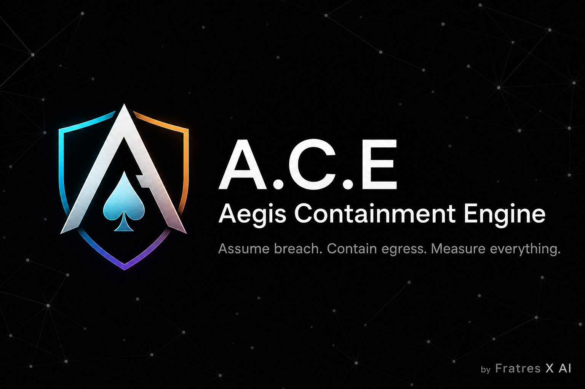
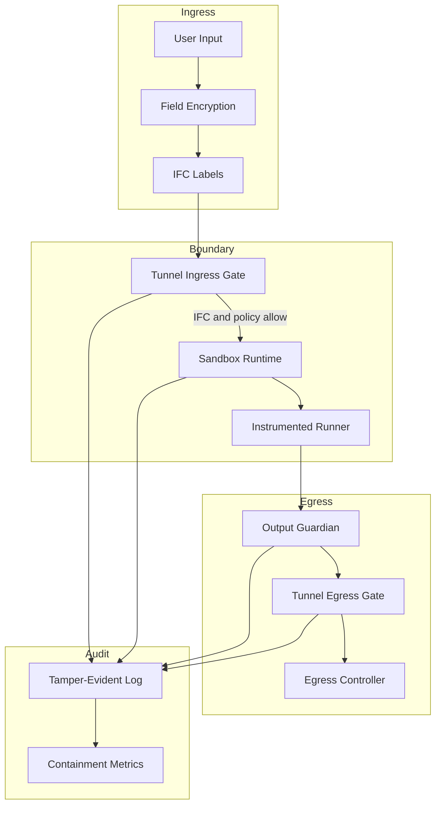

<p align="center">
  
</p>

<p align="center">
  Auditable, layered AI containment for systems that must survive scrutiny.<br/>
  Built by <a href="https://www.fratres-x.com">Fratres X AI</a>.
</p>

<p align="center">
  <a href="https://github.com/Fratres-X-AI/A.C.E/actions/workflows/ci.yml"></a>
  
  
  
  
  
</p>

---

**No unbreakable AI. No magic perimeter.**  
A.C.E assumes breach and rigorously limits what can leave a workload in usable form — with reviewable evidence, honest maturity labels, and measurable catch rates.

> Assume breach. Contain egress. Measure everything.

## Maturity

| Label | Meaning |
|-------|---------|
| **Prototype** | Working end-to-end demos, CI-gated tests, real sandbox backends, red-team harness |
| **Not production-hardened** | TEE quote verification stubs, rule-based guardians (LLM-judge optional), process sandbox on nested hosts is isolation-limited |

We separate research, prototype, and production boundaries on purpose. Claims stay conservative.

## What A.C.E is

A composable containment stack you wrap around model and agent workloads:

1. **Ingress** — field encryption, IFC labels, tunnel policy
2. **Boundary** — pluggable sandbox runtime + instrumented execution
3. **Egress** — output guardians, rate limits, session kill
4. **Audit** — hash-chained tamper-evident logs + compliance export

Perfect blocking is impossible under neural compression and side channels. A.C.E inverts the problem: run the work, control the exit, prove what happened.

## Architecture



## Quickstart

```bash
git clone https://github.com/Fratres-X-AI/A.C.E.git
cd A.C.E
python -m venv .venv

# Windows
.venv\Scripts\activate
# Linux / macOS
# source .venv/bin/activate

pip install -e ".[dev]"
```

### Prove containment (no GPU)

```bash
python examples/containment_benchmark.py   # red-team catch rate
python examples/sandbox_exfil_demo.py      # sandbox + egress block
python scripts/export_compliance_pack.py  # artifacts/compliance_pack/
```

### Local mock agent (full stack, laptop-friendly)

```bash
python examples/local_mock_agent_demo.py
```

### Real model paths

| Path | When to use |
|------|-------------|
| [HF Inference API](docs/runpod_quickstart.md#hugging-face-inference-api--llama-no-gpu-no-weight-download) | Llama via `HF_TOKEN` + router — no GPU download |
| [Local HF weights](docs/runpod_quickstart.md#real-hugging-face-model-small-default) | Small ungated models on a GPU pod |
| [Integration guide](docs/integration_guide.md) | Wire Ollama / vLLM / your handler |

```bash
export HF_TOKEN=hf_...
bash scripts/runpod_api_setup.sh
```

### Tests

```bash
pytest --cov=aegis --cov-report=term-missing
ruff check src tests examples scripts
mypy src/aegis
```

## Layers

| Layer | Module | Why it matters |
|-------|--------|----------------|
| Field encryption | `crypto/encryption_fields` | Shrinks plaintext blast radius |
| Weight obfuscation demo | `crypto/equivariant` | Linear similarity transform — **not encryption** |
| Information flow control | `ifc/` | BLP sensitivity + integrity via `dominates()` |
| Agent label tracking | `ifc/agent_planner` | Propagates labels through tools and memory |
| TEE abstraction | `execution/tee_*` | Attestation binding (adapters + stub verify) |
| Instrumented runner | `execution/instrumented_runner` | No silent bypass of inference |
| Output guardian | `guardians/output_guardian` | PII, entropy, stego, canaries |
| Egress controller | `guardians/egress_controller` | Throttle / block / kill session |
| Tamper-evident log | `audit/tamper_proof_log` | Hash-chained append-only trail |
| Metrics + export | `audit/metrics`, `compliance_export` | Effectiveness score, submission packs |
| Red-team harness | `redteam/simulator` | Self-auditing stress scenarios |
| Sandbox runtime | `sandbox/` | bubblewrap · Docker · process (gVisor/Firecracker registered, not yet functional) |
| Tunnel gateway | `tunnel/` | Policy-controlled ingress/egress |

## Sandbox backends

Registry-driven. Real isolation only — no fake in-process “sandbox.”

| Platform | Auto order |
|----------|------------|
| **Linux** | `bubblewrap` → `docker` → `process` (if allowed) |
| **Nested containers (e.g. RunPod)** | often `process` (separate OS process; not namespace isolation) |
| **Windows / macOS** | Windows Sandbox → Docker fallback |

```bash
python examples/sandbox_backend_demo.py --backend auto
# Docker image (Windows/macOS or Docker-capable hosts):
docker build -f Dockerfile.sandbox -t ace-aegis-sandbox:local .
```

Policy: [`policy.yaml`](policy.yaml) · env: `ACE_SANDBOX_BACKEND`

Callable workloads must be registered with `@register_workload("name")` before isolated execution.

## Evidence over narrative

A.C.E is built for review:

- **Red-team scenarios** with reported catch rate
- **Hash-chained audit** reconstructable after the fact
- **Compliance packs** under `artifacts/compliance_pack/`
- **Documented trade-offs** (security benefit vs cost)

Defense stays defensive. No offensive capability generation.

## Known limitations

- Nested cloud pods often cannot create Linux namespaces — use `process` or a bare-metal/VM host for bubblewrap
- Docker Desktop on Windows/macOS works but is heavier than Linux-native runtimes
- MCP adapter is a secure RPC pattern, not full MCP server-spec compliance
- Weight-obfuscation demo and proof placeholders are **not** HE / ZK — do not treat as production crypto
- TEE verification accepts simulated quotes only; hardware quotes fail closed until DCAP/KDS
- Math interface reports SymPy parse success, not physical or formal verification
- Guardian stack is primarily rule-based today; LLM-judge is on the roadmap
- gVisor / Firecracker backends are stubs until guest workloads work

## Documentation

| Doc | Contents |
|-----|----------|
| [Architecture](docs/architecture.md) | Layer model and design intent |
| [Sandbox + Tunnel](docs/sandbox_tunnel.md) | Isolation and boundary gates |
| [Integration](docs/integration_guide.md) | Ollama, RunPod, TEE notes |
| [RunPod quickstart](docs/runpod_quickstart.md) | Smoke, HF weights, Inference API |
| [Roadmap](docs/extension_roadmap.md) | Phased extension plan |
| [Docs index](docs/README.md) | Full index |

## Contributing & security

- [Contributing](CONTRIBUTING.md)
- [Code of Conduct](CODE_OF_CONDUCT.md)
- [Security policy](SECURITY.md) — private vulnerability reports preferred
- [Changelog](CHANGELOG.md)

## License

Copyright (C) 2026 Fratres X AI

A.C.E is free software under the [GNU Affero General Public License v3 or later](LICENSE) (AGPL-3.0-or-later).  
Source available for audit and downstream scrutiny. If you modify and run it as a network service, AGPL requires you to offer corresponding source to users of that service.

## Fratres X AI

A.C.E is part of the Fratres X AI lab — reviewable AI, autonomy, and defensive technology prototypes with physics-first modeling and honest maturity labels.

**Site:** [fratres-x.com](https://www.fratres-x.com) · **Org:** [Fratres-X-AI](https://github.com/Fratres-X-AI)
