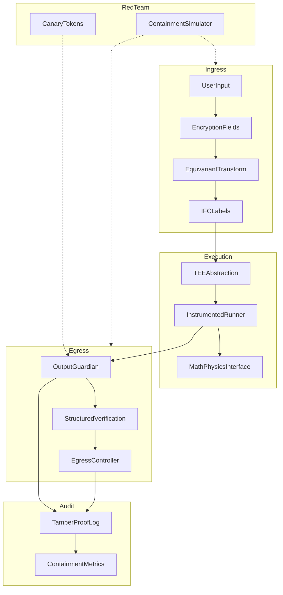

# A.C.E — Aegis Containment Engine

**Repository:** [github.com/FratresMedAI/A.C.E](https://github.com/FratresMedAI/A.C.E)

**Auditable, layered AI containment and defensive enforcement.**

We do not sell "unbreakable AI." We build auditable containment systems that **assume breach** and rigorously limit blast radius and exfiltration. A.C.E delivers measurable, verifiable risk reduction through defense-in-depth — composable layers that control what (if anything) gets out in usable form.

## Vision

Neural compression creates irreducible mixing and side channels. Perfect perimeter blocking is impossible. A.C.E inverts the threat model:

- **Let inputs in** — run the workload
- **Control egress** — guardians, IFC, encryption fields, audit
- **Measure everything** — tamper-evident logs, containment metrics, compliance artifacts

## Architecture



## Quickstart

```bash
cd "ACE Engine"
python -m venv .venv
.venv\Scripts\activate        # Windows
pip install -e ".[dev]"

# Run demos
python examples/exfil_attempt_demo.py
python examples/secure_agent_demo.py
python examples/math_physics_advisor_demo.py
python examples/containment_benchmark.py
python examples/local_mock_agent_demo.py
python scripts/export_compliance_pack.py

# Test suite
pytest --cov=aegis --cov-report=term-missing
ruff check src tests
mypy src/aegis
```

## Feature Matrix

| Layer | Module | Why It Matters |
|-------|--------|----------------|
| Field Encryption | `crypto/encryption_fields` | Limits in-memory blast radius of sensitive inputs |
| Equivariant Encryption | `crypto/equivariant` | Offline weight obfuscation with equivariant ops (prototype) |
| Information Flow Control | `ifc/` | Prevents explicit label violations (no read-up / no write-down) |
| Agent Label Tracking | `ifc/agent_planner` | Fides-style propagation through tools and memory |
| TEE Abstraction | `execution/tee_abstraction` | Attested execution binding for confidential compute |
| Instrumented Runner | `execution/instrumented_runner` | No bypass paths for inference |
| Math/Physics Interface | `execution/math_physics` | Structured verified outputs only — no free-text exfil |
| Output Guardian | `guardians/output_guardian` | PII, entropy, steganography, canary detection |
| Egress Controller | `guardians/egress_controller` | Rate limit, throttle, session kill |
| Verification | `guardians/verification` | JSON schema, ensemble consensus, ZK hooks |
| Tamper-Proof Log | `audit/tamper_proof_log` | Hash-chained append-only audit trail |
| Metrics | `audit/metrics` | Containment effectiveness score, compliance export |
| Red-Team Simulator | `redteam/simulator` | Self-auditing stress tests |

## Trade-offs

| Choice | Security Benefit | Performance Cost |
|--------|-----------------|------------------|
| Field encryption | Smaller plaintext exposure | ~1ms per field (Fernet) |
| Equivariant transform (offline) | Weight obfuscation | Near-zero at runtime (prototype) |
| Guardian entropy scan | Catches high-density exfil | O(n) on output length |
| IFC enforcement | Blocks illegal label flows | O(steps) per request |
| Tamper-proof log | Full audit reconstructability | O(1) append, O(n) verify |
| Fail-closed policy | No silent bypass on ambiguity | May block edge cases |

## Local-Only Workflow (no Ollama / no cloud)

Low-spec laptops can run the full stack with a **mock model** and export audit artifacts:

```bash
python examples/local_mock_agent_demo.py   # agent + IFC + persistent SQLite audit
python scripts/export_compliance_pack.py   # benchmark + manifest + file hashes
```

Outputs land in `artifacts/compliance_pack/` with a `manifest.json` suitable for submissions.

Default policy: [`policy.yaml`](policy.yaml)

1. **Real TEE**: Use `create_tee_environment()` — Intel TDX / AMD SEV-SNP auto-detected; see `examples/tee_attestation_demo.py`
2. **Scale EE**: Batch offline transforms for Llama-scale weights
3. **LLM Judge**: Replace `llm_judge_stub` with verifier model API
4. **Policy-as-code**: Load YAML from `Policy.from_file("policy.yaml")`
5. **Ollama/RunPod**: Wrap inference in `InstrumentedRunner` (see `docs/integration_guide.md`)

## DIU / Gov Compliance Notes

- AGPLv3 license — source availability for audit
- Exportable compliance artifacts via `ContainmentMetrics.export_compliance_artifact()`
- Tamper-evident hash-chained logs suitable for OT submissions
- Defensive-only — no offensive capability generation
- All trade-offs documented with measurement hooks

## License

AGPLv3 — see [LICENSE](LICENSE).

## Documentation

- [Architecture](docs/architecture.md)
- [Integration Guide](docs/integration_guide.md)
- [Extension Roadmap](docs/extension_roadmap.md)
